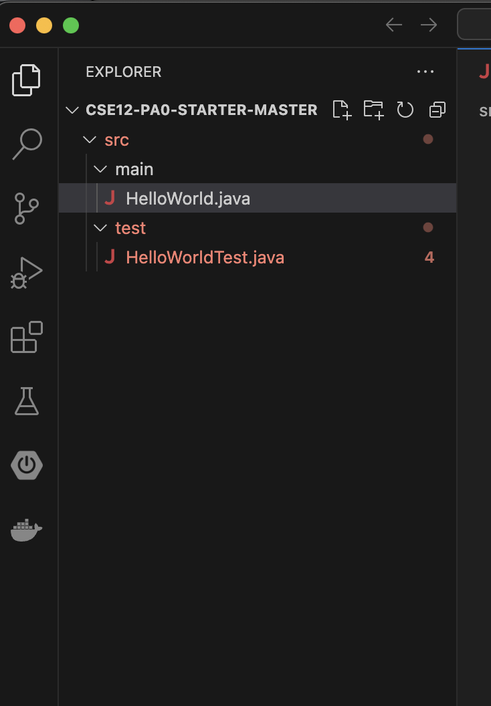
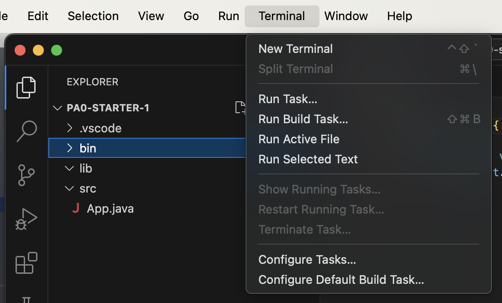
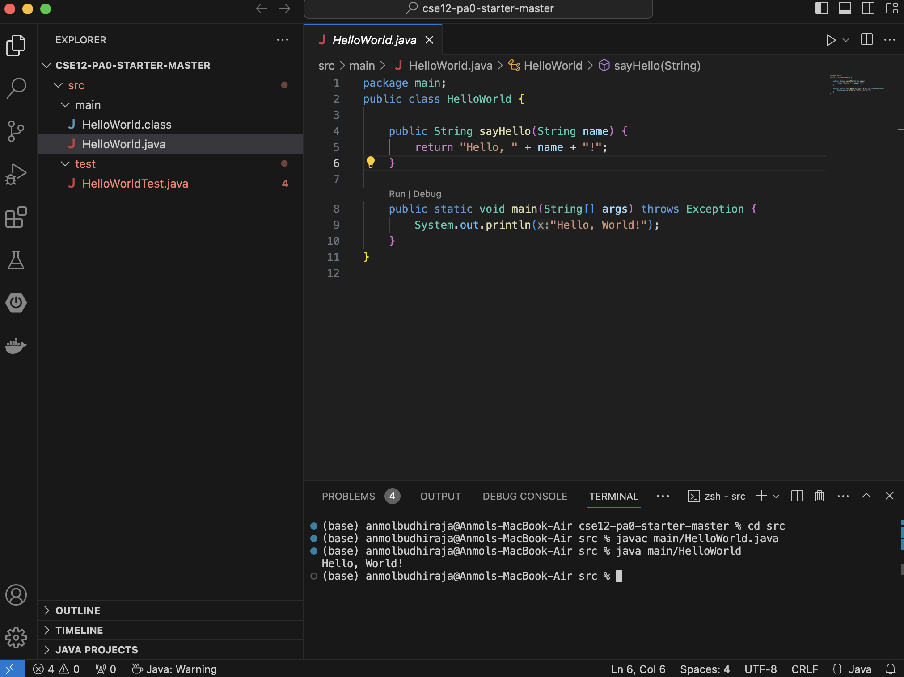
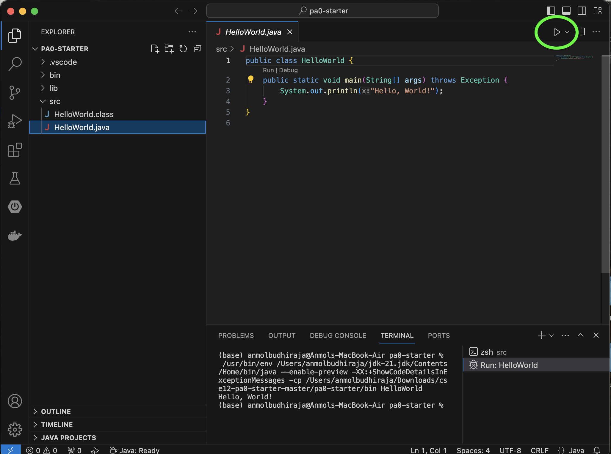
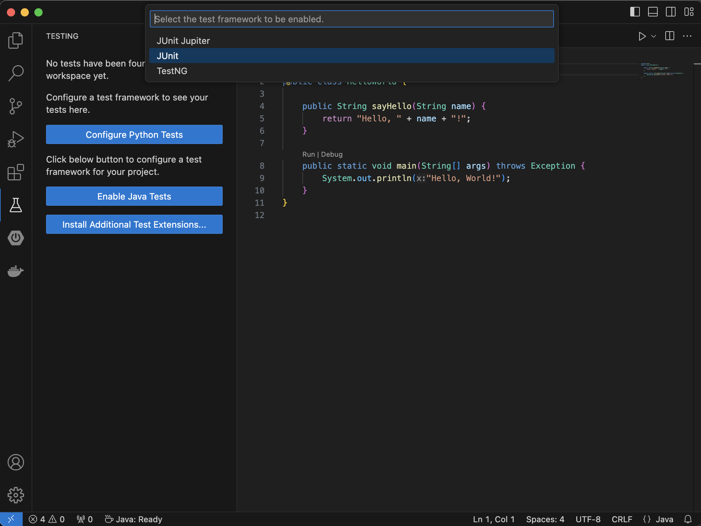
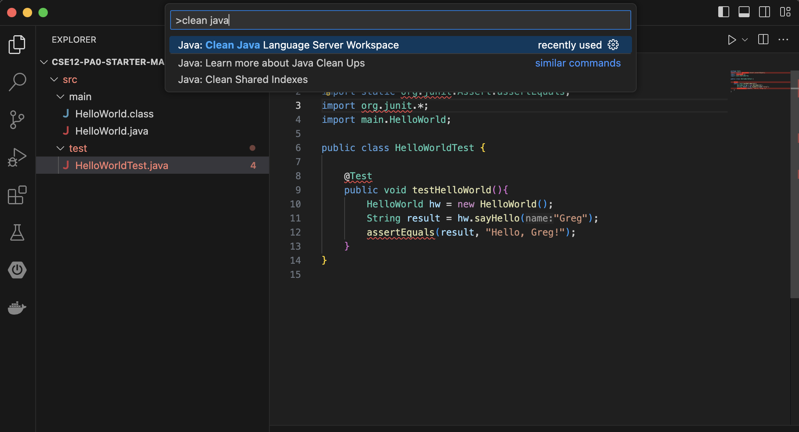
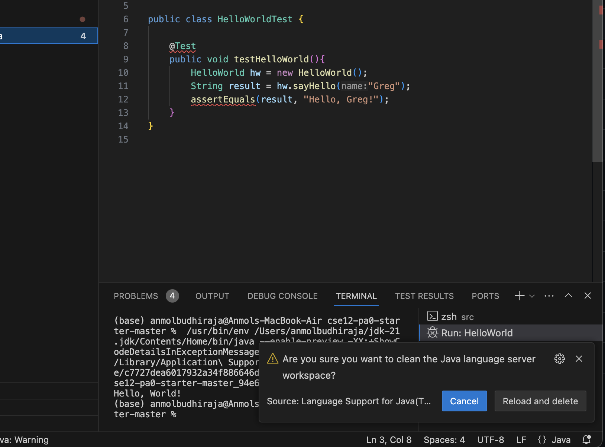
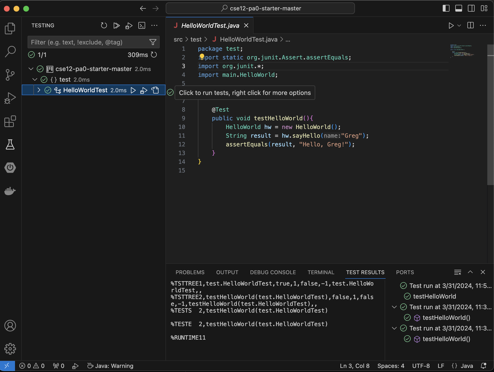

# CSE 12 Programming Assignment 0 (Optional)

### Computer Setup

This optional assignment will teach you how to setup Java and VSCode, get the starter code from GitHub, and how to run VSCode projects from your own computer. If you already have the JDK installed from a previous quarter and a way to edit, compile and run Java programs, then you can skip this assignment. If you plan on using the lab computers in the CSE basement, you can also skip this assignment.

We recommend using an integrated development environment (IDE) such as VSCode for CSE 12. IDEs differ from text editors like Sublime in integrating code editing with building and testing capabilities. Although you are welcome to use any IDE or text editor for programming, the course staff is most familiar with VSCode and may not be able to help you with programming environment issues if you choose to use an environment such as IntelliJ or Eclipse. 

There is no submission or grade for this assignment. You should complete the installation and setup of your Java tools prior to starting PA1 which will be released on Monday, July 1st.

If you run into any problems, please reach out to a tutor during tutor hours using [https://autograder.ucsd.edu/](https://autograder.ucsd.edu/){:target="_blank"} to get 1-on-1 help (make sure to select CSE12 - SS124), or stop by instructor/TA office hours.

*What if I already have a different version of Java?* In general, you will most likely be fine, but if you run into problems compiling and running your code, we will suggest uninstalling your old version and reinstalling the latest JDK.

## Using the CSE Basement Lab Computers

Log into a lab machine using your regular UCSD credentials.
- If the lab computer is in Windows then restart and choose CentOS.

## Download Java & VSCode

### Step 1: Installing Java and VSCode
General instructions for setting up your environment and installing Java and VSCode can be found in this [document](https://drive.google.com/file/d/18sR1b6DkCc1rRY_KDiTwJQ85_HAeai-D/view). 

### Step 2: Installing Extension Pack for Java
The [Extension Pack for Java](https://marketplace.visualstudio.com/items?itemName=vscjava.vscode-java-pack) adds support for Java and JUnit, and you need to install it on your system by going into the Extensions Tab in VSCode.

## Getting the Code

The starter code can be found at the following GitHub repository **(link to be released)**.
<!-- [Github repository](https://github.com/ucsd-cse12-sp24/cse12-pa0-starter){:target="_blank"}.  -->
If you are not familiar with Github, here are two easy ways to get your code.

- *Download as a ZIP folder.* After going to the Github repository, you should see a green button that says *Code*. Click on that button. Then click on *Download ZIP*. This should download all the files as a ZIP folder. You can then unzip/extract the zip bundle and move it to wherever you would like to work.

- *Using git clone (requires terminal/command line).* After going to the Github repository, you should see a green button that says *Code*. Click on that button. You should see something that says *Clone with HTTPS*. Copy the link that is in that section. In the terminal, navigate to the directory you would like to work. Type the command `git clone _`, where the `_` is replaced with the link you copied. This should clone the repository onto your computer, and you can then edit the files in whatever IDE you see fit.
    
If you are unsure or have questions about how to get the starter code, feel free to make a Piazza post or ask a tutor for help.

## Running a Java Program in VSCode 

Open VScode and wait for it to prompt you to Open a Folder. A new window will open for you to select a folder to open. To open the given starter code, navigate to the folder `pa0-starter` (if you got the code using `git clone`) or `pa0-starter-master` (if you downloaded the code as a ZIP file), and open it. This is how your directory structure should look like:

There are a few options to run the file. 

**First option:** open the VSCode terminal, and use command line to compile and execute the Java file.

  

In the terminal, go to the **src** directory that is inside the `pa0-starter` or `pa0-starter-master` directory. To compile and execute the program, type the following commands in the terminal.

- Compile: `javac main/HelloWorld.java`
- Execute: `java main/HelloWorld`

Note: We are using `main/` before because the file is not in the `src` directory that our terminal is in, it is in the `main` directory that is inside the `src` directory.

**Second option:** use the Play button on the top right of the window. 

  

You should now see "Hello World!" printed to the VSCode terminal.
You have successfully ran a program on VSCode!

## Running Tests through JUnit

JUnit is by far the most popular and widely-used unit testing framework for Java. We will use the version 4 of this framework: JUnit 4. In JUnit, you build one or more test classes and use a test runner to execute them. 

The Test Runner for Java extension can be used for running JUnit tests with VSCode. This extension comes in the Extension Pack for Java mentioned in Part 1, and does not need to be installed separately if the Java Extension Pack was installed: [https://marketplace.visualstudio.com/items?itemName=vscjava.vscode-java-test](https://marketplace.visualstudio.com/items?itemName=vscjava.vscode-java-test)

Documentation for using it can be found here:
[https://code.visualstudio.com/docs/java/java-testing#_enable-testing-and-adding-test-framework-jars-to-your-project](https://code.visualstudio.com/docs/java/java-testing#_enable-testing-and-adding-test-framework-jars-to-your-project)

Any instructions pertaining to Maven or Gradle can be ignored. Follow instructions for using it with an “Unmanaged Folder”, and enable JUnit through the Testing Explorer.

Important note: When enabling tests through the extension, make sure to select JUnit as your test framework instead of JUnit Jupiter or TestNG. JUnit is JUnit 4 (the version we will be using in this course).

If you follow the instructions and tests don’t run, run the following command in VSCode:

* Ctrl + Shift + P: Opens the Command
* Search for “java clean” or “Java: Clean Java Language Server Workspace” and run that command
* Java Clean also works great if you run into other issues with Java in VSCode

* Hit the “Reload and Delete” button and check the Testing Explorer again

* If your JUnit has been set up correctly, you should be able to see a play button beside the test. You can click on that to run the test. Alternatively, you can go to the left hand side testing panel to see all tests in your directory, and run them.
* Also, you should see two new .jar files added to your lib folder - hamcrest-core-1.3.jar, and junit-4.13.2.jar. These are the files that help us in running tests through JUnit 4. 
  

_Though we very strongly recommend using VSCode, if you are still interested in working on Eclipse, you can follow this [documentation](https://docs.google.com/document/d/1ExUKTTV19OBbYqaDmnz4TfDlbrRORy0fgo3UO3nDGRY/edit#heading=h.60uzkqq015s9) to install Eclipse, and this [documentation](https://docs.google.com/document/d/1Rct96DQjMLrUIhkRURIt6broCXyOmsjJI374K3AvSoU/edit?usp=sharing) to setup JUnit in Eclipse_

## Submitting

There is no submission for this assignment.

## Java Refresher Resources

Text-Based
- Benjamin Evans and David Flanagan: Java in a Nutshell, 7th edition, O'Reilly, 2018 [online](https://www.oreilly.com/library/view/java-in-a/9781492037248/){:target="_blank"} (this is a great reference book, but if you have another, that's OK)
- [http://docs.oracle.com/javase/tutorial/Links](http://docs.oracle.com/javase/tutorial/Links){:target="_blank"}  (text tutorial)
- [http://www.javaworld.com/article/2075202/core-java/object-oriented-language-basics-part-1.html](http://www.javaworld.com/article/2075202/core-java/object-oriented-language-basics-part-1.html){:target="_blank"} (text tutorial)
